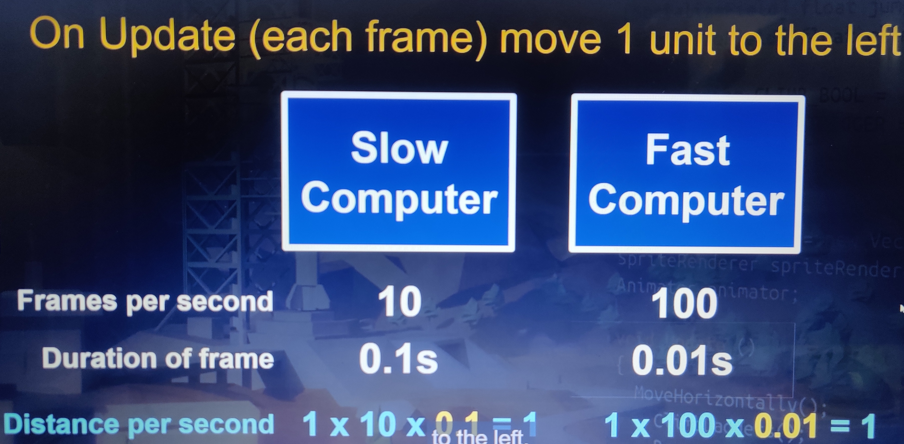
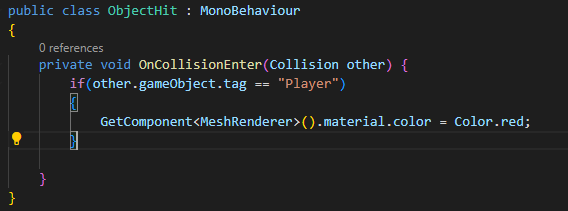
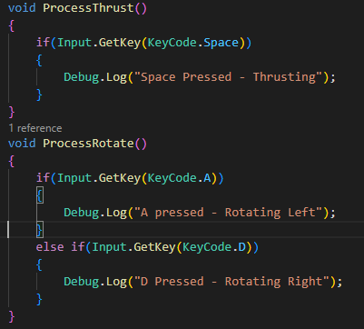
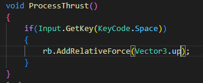
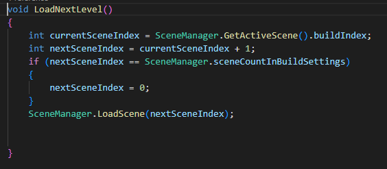
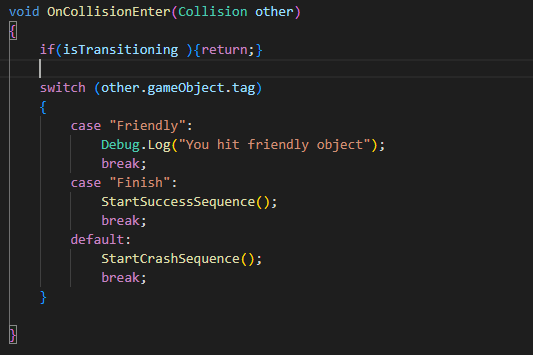
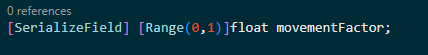
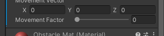
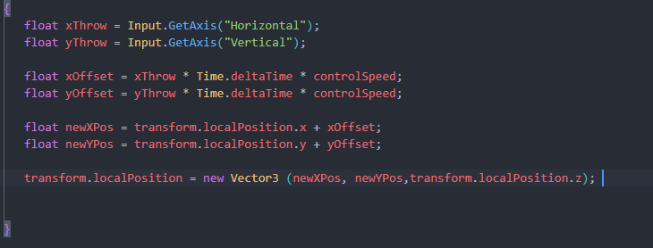

# Unity3d
**Prefabs** : used to make identical objects of same property for eg. Coins, Enemies, etc 
you can make an object in heirarchy into a prefab just by draging it into project browser.

**Grouping** : Group objects in unity by creating an empty object and dragging the objects which need to be grouped.

**Scripts** : Unity use C# language to make scripts to do stuff. it have a public class named after the file name. 

**Start() & Update()** : These methodes in C# script. When you write code in start it will be called once when the game start. The update methode execute the code in it every frame.

**Basic Movement** : We can move objects in unity with the script. code to do that will be:
`transform.Translate(x,y,z);` in the place of x,y, and z we need to give float value.
        **Note** : Remember to attach the script to the target object by dragging it into the inspect menu of the object.
        
**variables** : just like other programming languages we can create variables in C# using different data types. For eg : `int hitPoints = 10.5f;` .

**Materials** : inorder to add color to objects we use materials. it can be cretated by right clicking inside project browser and create material. drag the material to object to applay it to object. remeber to change the color in inspector.

**SerializeField** : serialized field is used to show variables in inspector so that it can be modified easily. For eg : `[SerializeField] float jumpHieght = 0f`.
**Input** : inorder  for movement of player we use input manager in unity. it can be accessed by going to edit -> project settings. There are different axes. the one we commnly used for the front back left right movement are horizintal and vertical axes.
the player can be moved using the following code with inputs :
`Input.GetAxis("Horizontal")` or  `Input.GetAxis("Vertical")` and giving this value to a variable inside inside update methode. and passing the variable into the transform.translate method.


**Time.deltaTime** : When we use the above code it will different movement for different computers since frames in different computer differs. so on a more fps pc the object move faster to prevent this we multiply input statement with **time.deltaTime**.


this 0.1 and 0.01 is Time.deltaTime it differ for each pc.

**Cinemachine** : inorder to move camera based on player movement we use cinemachine for this purpose. First we need to install cinemachine package from window -> package manager

and after install add cinemachine brain component to main camera in inspector.
then add a virtual camera to heirarchy. in the inspector of virtual camera there is a virtual camera component inside it there is a follow set it player and change body to framing transposer.

**Rigid Body** : now if we create walls the player will still pass through it so we need to add a rigid body component to player. uncheck gravity if needed. and in contrains section we can freeze certain position and and rotation inside rigid body component.
**functions or methods** : eg. 
```
void functionName()
{

//statements

}
```
in the place of void we give int and other data types based on the return type. if there are any parameters we pass it inside parenthesis '()'.
**OnCollisionEnter** : it is a built in method calls everytime when an object hit the scripted object.

**GetComponent** : inorder to access the component of an object in the scene we use GetComponent Methode .
for example to change color :
```
GetComponent<MeshRenderer>().material.color = Color.red;
```
**Time.time** : This help to show the time since the game has started.

**enable property** : The getcomponent have a enabled property which will help to turn on or off the component. for example mesh renderer which can be turned off to hide mesh.
syntax : `GetComponent<MeshRenderer>().enabled = false;`

**Caching Reference** : if we need to call this mesh renderer every time it is wise to create a varible and give reference in it. by:
`MeshRenderer renderer;`
now we can use
```
renderer = `GetComponent<MeshRenderer>()
renderer.enabled = true;
```

**Tags** : when we doing onCollisionEnter the problem is that we didn't specify which object hit.
so if we need to change color if only player hits. we use tags. first select the player and in inspector give the tag as player. Then use the following code :



**tansform.Rotate** : to change rotation of object. takes mainly three parameters x,y,z
`transform.Rotate(x,y,z);`

**Input.GetKey** : Other than using input manager we can give movement with getkey keyword.



**AddRelativeForce()** : it is used to give force to player relative to it's axes.

**Vector3.up** : it is the shorthand way of writing (0,1,0)



here rb is the reference to a rigid body.

**freezeRotation** : Rotation can be freezed with `rb.freezeRotation = true;` using script.

**Grvaity of World** : Inorder to change gravity of the world goto project settings -> Physics and set gravity 

**Audio** : for audio to work on unity first we need a audio listner wich will be on main camera. if there is none add one. then the we need audio source which can be player , enemy or anything add audio source component to it. now to activate it on code we create a reference to audio source using get component for ex myAudio.and use myAudio.play(). to stop we use myAudio.Stop(). to check if playing we use myAudio.isPlaying.

**Respwan** : for the player to respawn ie reloading the scene first got build settings. add the scene by clicking add open scenes. the right end of the screen there is a number which is index 0 for first scene. now on code use the UnityEngine.SceneManagement name space and in code use
`SceneManager.LoadScene(BuildIndex);` or `SceneManager.LoadScene(SceneManager.GetActiveScene().buildIndex);`

**LoadNextLevel** : inorder to load next scene and come back to first scene if there is no next scene we use the following code:



**Invoke** : Using invoke allows us to call a method so it executes after a delay of x seconds.
syntax : `Invoke("MethodName", delayInSeconds);`

**PlayOneShot** : Play one shot is used to play audio which have a audioclip parameter.
we create a audioclip reference with serializefield and pass tha audio.

**States** : you can create states in your game. for example is the player alive or isTransitioning,etc
a clever way to add this is like this :




now in the different events we add isTransition to true. so when that even happens isTransition is true. and from above we can see that if isTransitioning is true it just return before it goes to switch statements again.

**Particle System**:  particle system can be added like adding cubes and other shapes.
once added give reference and use `winparticle.play();`. it would work just like audios.

**Slider in inspector** : inorder to get a slider in inspector we use range for example:


if we add this code we get a slider like  below.



**Ocillation of objects** : refer the project rocket alpha and it's oscillation script.

**Quit game** : After the build the game it is  hard to quit. so we use `Application.Quit();` and getkeydown to quit the game.

**terrain** : you can easily add terrains just like adding a cube. 
- In order to get more functionality while modifying terrains we install and use terrain tools plugin from package manager.
- Modify terrain according to you ideas with tools and brushes.
- To add texture to terrain we use  paint texture option after selecting paint terrain option in terrain tool from terrain inspector.
- To add new texture we click add layer or create layer. 
- The first layer will be applied fully into terrain.
- Add more layers and paint it to terrain.
- Note : if the texture size not as expected change it inside layer properties.
- 
**Paint Trees**: After importing trees from unity asset store in inspector select paint tree and click on edit tree and add new trees. and paint them to terrain.

**Timeline** :  To make games like argon assault (refer my github) in which player automatically move forward by time we use timelines. 
- Timeline can be attached to any object. it's best to attach to empty object if you have no other object to attach to.
- Now after that create a timeline call it whatever. click on the + icon add animation track.
- Drag the object to animate into the animator and it will ask to create a animator .
- Now positon the game object correctly and click record.
- for initial keyframe just move the object slightly. 
- now after changing the time move position object. it will add another keyframe.
- Tip : If you want the gameobject to posion to your view click on game object and press align with view.
- if you want to edit animation you can tweak position values by pressing the graph icon next to animator in timeline window and change each position and rotation accordingly.

**Input Systems in unity** : There are two types of input systems in unity One is default input system and the other new input system which can be imported using package manager.
The first one uses default axes found in project settings like vertical and horizontal for example.
the new one creates new references and stuff. 
Refer this Video :

**Old input Manager** : uses the following code to move player.


**mathf.Clamp()** : Documentation : https://docs.unity3d.com/ScriptReference/Mathf.Clamp.html

inorder to constrain a value for example position of object to a range we use clamp. <br> eg : ` Mathf.Clamp(rawXPos, -xRange, xRange); `<br> here rawXPos is the value we need to change and the other two parameters are min and max values for the rawXPos.


**Created by Shadirvan**


